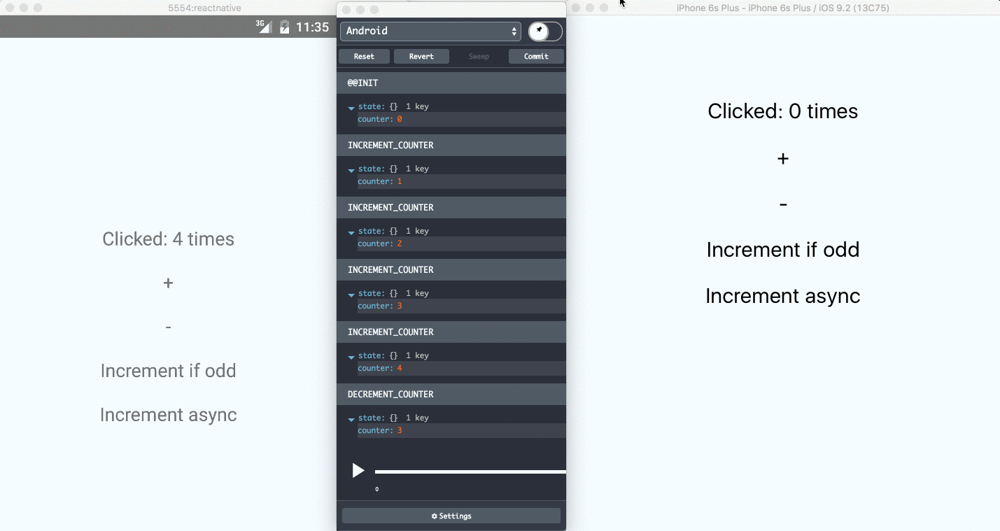

Remote Redux DevTools
=====================



Use [Redux DevTools](https://github.com/gaearon/redux-devtools) remotely for React Native, hybrid, desktop and server side Redux apps.

### Installation

```
npm install --save-dev remote-redux-devtools
```

### Usage

Just [add our store enhancer to your store](https://github.com/zalmoxisus/remote-redux-devtools/commit/eb18fc49e1f083a2330939af52da349b862f8df1):

##### `store/configureStore.js`

```js
import { createStore, applyMiddleware, compose } from 'redux';
import thunk from 'redux-thunk';
import devTools from 'remote-redux-devtools';
import reducer from '../reducers';

export default function configureStore(initialState) {
  const enhancer = compose(
    applyMiddleware(thunk),
    devTools()
  );
  // Note: passing enhancer as last argument requires redux@>=3.1.0
  const store = createStore(reducer, initialState, enhancer);
  // If you have other enhancers & middlewares
  // update the store after creating / changing to allow devTools to use them
  devTools.updateStore(store);
  return store;
}
```

#### Important

In order not to allow it in production by default, the enhancer will have effect only when `process.env.NODE_ENV === 'development'`. In case you don't set `NODE_ENV` or want to use it in production, set `realtime` parameter to `true`:

```js
const enhancer = compose(
  applyMiddleware(thunk),
  devTools({ realtime: true })
);
```

### Monitoring

Use one of our monitor apps to inspect and dispatch actions:
* [web](http://remotedev.io/local)
* [redux-devtools-extension](https://github.com/zalmoxisus/redux-devtools-extension) - Click "Remote" button (or press [`Cmd+Ctrl+Arrow up`](https://github.com/zalmoxisus/redux-devtools-extension#keyboard-shortcuts)) to open remote monitoring.
* [react-native-debugger](https://github.com/jhen0409/react-native-debugger) - Electron app, which already includes `remotedev-server`, `remotedev-app` and even React DevTools.
* [chrome app](https://chrome.google.com/webstore/detail/remotedev/faicmgpfiaijcedapokpbdejaodbelph).
* [remote-redux-devtools-on-debugger](https://github.com/jhen0409/remote-redux-devtools-on-debugger) - Used in React Native debugger as a dock monitor.
* [atom-redux-devtools](https://github.com/zalmoxisus/atom-redux-devtools) - Used in Atom editor.
* [redux-dispatch-cli](https://github.com/jhen0409/redux-dispatch-cli) - A CLI tool for Redux remote dispatch.

Use [remotedev-app](https://github.com/zalmoxisus/remotedev-app) to create your own monitor app.

### Communicate via local server

In order to make it simple to use, by default, the module and the monitor app communicate via [remotedev.io](http://remotedev.io) server. Use [remotedev-server](https://github.com/zalmoxisus/remotedev-server) cli to run it locally in order to make the connection faster and not to require an internet connection.
You can import it in your `server.js` script and start remotedev server together with your development server:
```js
var remotedev = require('remotedev-server');
remotedev({ hostname: 'localhost', port: 8000 });
```
See [remotedev-server](https://github.com/zalmoxisus/remotedev-server) repository for more details.
For React Native you can use [react-native-debugger](https://github.com/jhen0409/react-native-debugger) or [remote-redux-devtools-on-debugger](https://github.com/jhen0409/remote-redux-devtools-on-debugger), which already include `remotedev-server`.


### Parameters

Name                  | Description
-------------         | -------------
`name`                | *String* representing the instance name to be shown on the remote monitor.
`realtime`            | *Boolean* specifies whether to allow remote monitoring. By default is `process.env.NODE_ENV === 'development'`. 
`hostname`            | *String* used to specify host for [`remotedev-server`](https://github.com/zalmoxisus/remotedev-server). If `port` is specified, default value is `localhost`.
`port`                | *Number* used to specify host's port for [`remotedev-server`](https://github.com/zalmoxisus/remotedev-server).
`secure`              | *Boolean* specifies whether to use `https` protocol for [`remotedev-server`](https://github.com/zalmoxisus/remotedev-server).
`maxAge`              | *Number* of maximum allowed actions to be stored on the history tree, the oldest actions are removed once maxAge is reached. Default is `30`.
`filters`             | *Map of arrays* named `whitelist` or `blacklist` to filter action types.  See the example bellow.
`actionSanitizer`     | *Function* which takes action object and id number as arguments, and should return action object back. See the example bellow.
`stateSanitizer`      | *Function* which takes state object and index as arguments, and should return state object back. See the example bellow.
`startOn`             | *String* or *Array of strings* indicating an action or a list of actions, which should start remote monitoring (when `realtime` is `false`). 
`stopOn`              | *String* or *Array of strings* indicating an action or a list of actions, which should stop remote monitoring. 
`sendOn`              | *String* or *Array of strings* indicating an action or a list of actions, which should trigger sending the history to the monitor (without starting it). *Note*: when using it, add a `fetch` polyfill if needed.
`sendOnError`         | *Numeric* code: `0` - disabled (default), `1` - send all uncaught exception messages, `2` - send only reducers error messages.
`sendTo`              | *String* url of the monitor to send the history when `sendOn` is triggered. By default is `${secure ? 'https' : 'http'}://${hostname}:${port}`.
`actionCreators`      | *Array* or *Object* of action creators to dispatch remotely. See [the example](https://github.com/zalmoxisus/remote-redux-devtools/commit/b54652930dfd4e057991df8471c343957fd7bff7).
`id`                  | *String* to identify the instance when sending the history triggered by `sendOn`. You can use, for example, user id here, to know who sent the data.

All parameters are optional. You have to provide at least `port` property to use `localhost` instead of `remotedev.io` server.

Example:
```js
export default function configureStore(initialState) {
  // Note: passing enhancer as last argument requires redux@>=3.1.0
  const store = createStore(
    rootReducer,
    initialState,
    devTools({
      name: 'Android app', realtime: true,
      hostname: 'localhost', port: 8000,
      maxAge: 30, filters: { blacklist: ['EFFECT_RESOLVED'] },
      actionSanitizer: (action) => (
       action.type === 'FILE_DOWNLOAD_SUCCESS' && action.data ?
       { ...action, data: '<<LONG_BLOB>>' } : action
      ),
      stateSanitizer: (state) => state.data ? { ...state, data: '<<LONG_BLOB>>' } : state
    })
  );
  // If you have other enhancers & middlewares
  // update the store after creating / changing to allow devTools to use them
  devTools.updateStore(store);
  return store;
}
```

### Demo
- [Toggle monitoring](http://zalmoxisus.github.io/monitoring/)

### Examples
- [Web](https://github.com/zalmoxisus/remote-redux-devtools/tree/master/examples)
- [React Native](https://github.com/chentsulin/react-native-counter-ios-android)

### License

MIT
